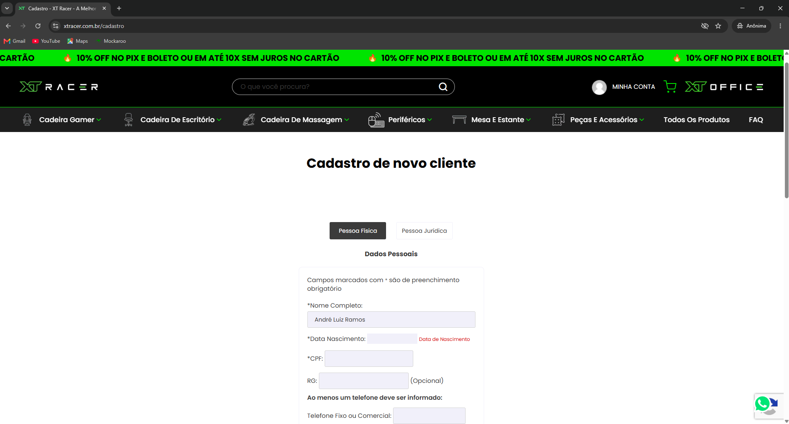
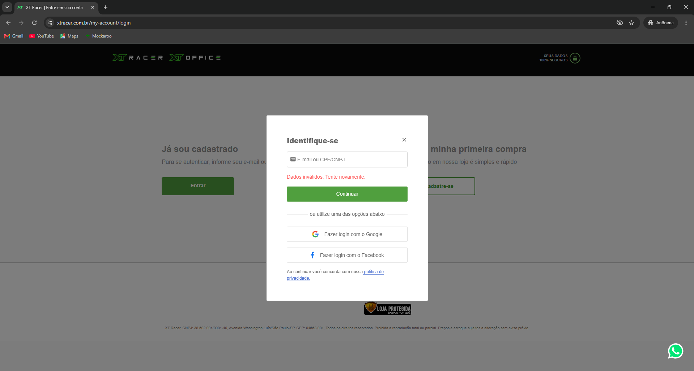
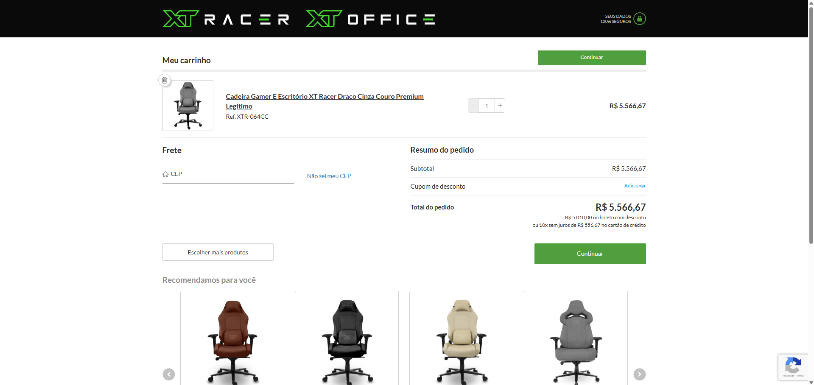
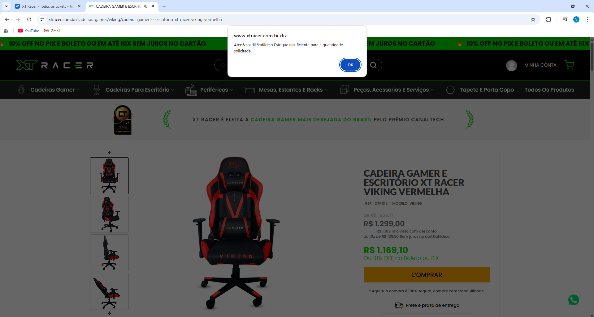

# Relatório de Bugs e Melhorias

## 💻 Cadastro de Usuário (PF e PJ)

### 🐞 BUG-CAD-01 — Sistema permite cadastro com endereço de e-mail em formato inválido

**Passos para reproduzir:**

1. Acessar a página de cadastro de usuários.
2. Selecionar o tipo de cadastro (Pessoa Física ou Pessoa Jurídica).
3. Preencher os campos "E-mail" e "Confirmação de E-mail" com um endereço de e-mail em formato inválido.
4. Preencher os demais campos obrigatórios com dados válidos.
5. Clicar no botão "AVANÇAR".

**Dados utilizados:**

| Campo | Valor |
|---|---|
| E-mail | usuario_19221%@live.com |
| Confirmação de E-mail | usuario_19221%@live.com |

**Resultado esperado:** O sistema deve impedir a conclusão do cadastro e exibir uma mensagem de validação informando que o endereço de e-mail é inválido.

**Resultado atual:** O sistema permite a conclusão do cadastro quando é informado um endereço de e-mail em formato inválido, sem exibir mensagem de validação.

| Prioridade | Severidade |
|---|---|
| Alta | Alta |

---

### 🐞 BUG-CAD-02 — Sistema permite cadastro com caracteres inválidos no campo "Nome Completo"

**Passos para reproduzir:**

1. Acessar a página de cadastro de usuários.
2. Selecionar o tipo de cadastro (Pessoa Física ou Pessoa Jurídica).
3. Preencher o campo "Nome Completo" com caracteres inválidos.
4. Preencher os demais campos obrigatórios com dados válidos.
5. Clicar no botão "AVANÇAR".

**Dados utilizados:**

| Campo | Valor |
|---|---|
| Nome Completo | 123# 456$ |

**Resultado esperado:** O sistema deve impedir a conclusão do cadastro e exibir uma mensagem de validação informando que o campo "Nome Completo" contém caracteres inválidos.

**Resultado atual:** O sistema permite a conclusão do cadastro quando o campo "Nome Completo" contém caracteres inválidos, sem exibir mensagem de validação.

| Prioridade | Severidade |
|---|---|
| Alta | Alta |

---

### 🐞 BUG-CAD-03 — Sistema permite cadastro com Razão Social incompatível com um nome empresarial

**Passos para reproduzir:**

1. Acessar a página de cadastro de usuários.
2. Selecionar a opção "Pessoa Jurídica".
3. Preencher o campo "Razão Social" com um valor inválido.
4. Preencher os demais campos obrigatórios com dados válidos.
5. Clicar no botão "AVANÇAR".

**Dados utilizados:**

| Campo | Valor |
|---|---|
| Razão Social | 123# $456 |

**Resultado esperado:** O sistema deve impedir a conclusão do cadastro quando é informada uma Razão Social incompatível com nome empresarial, exibindo uma mensagem de validação apropriada.

**Resultado atual:** O sistema permite a conclusão do cadastro mesmo quando o campo "Razão Social" contém apenas números e símbolos incompatíveis com um nome empresarial, sem exibir mensagem de validação.

| Prioridade | Severidade |
|---|---|
| Alta | Alta |

---

### 🐞 BUG-CAD-04 — Sistema permite cadastro com número de telefone celular inválido

**Passos para reproduzir:**

1. Acessar a página de cadastro de usuários.
2. Selecionar o tipo de cadastro (Pessoa Física ou Pessoa Jurídica).
3. Preencher o campo "Telefone Celular" com um número inválido.
4. Preencher os demais campos obrigatórios com dados válidos.
5. Clicar no botão "AVANÇAR".

**Dados utilizados:**

| Campo | Valor |
|---|---|
| Telefone Celular | (75) 64534-5356 |

**Resultado esperado:** O sistema deve impedir a conclusão do cadastro e exibir uma mensagem de validação informando que o número de telefone celular é inválido.

**Resultado atual:** O sistema permite a conclusão do cadastro quando é informado um número de telefone celular inválido, sem exibir mensagem de validação.

| Prioridade | Severidade |
|---|---|
| Média | Média |

---

### 🐞 BUG-CAD-05 — Sistema permite cadastro com Inscrição Estadual em formato inválido

**Passos para reproduzir:**

1. Acessar a página de cadastro de usuários.
2. Selecionar a opção "Pessoa Jurídica".
3. Preencher o campo "Inscrição Estadual" com Inscrição Estadual em formato inválido.
4. Preencher os demais campos obrigatórios com dados válidos.
5. Clicar no botão "AVANÇAR".

**Dados utilizados:**

| Campo | Valor |
|---|---|
| Inscrição Estadual | empresa12 exemplo34 |

**Resultado esperado:** O sistema deve impedir a conclusão do cadastro e exibir uma mensagem de validação informando que a Inscrição Estadual é inválida.

**Resultado atual:** O sistema permite a conclusão do cadastro quando é informada uma Inscrição Estadual em formato inválido, sem exibir mensagem de validação.

| Prioridade | Severidade |
|---|---|
| Alta | Alta |

---

### 💡 IMP-CAD-01 — Ajustar validação e formatação dos campos "RG" e "Inscrição Estadual"

**Contexto:** Atualmente os campos "RG" e "Inscrição Estadual" aceitam valores incompatíveis com o formato esperado, como espaços em posições inadequadas, símbolos não permitidos e várias sequências de letras. Recomenda-se aprimorar a validação desses campos, restringindo valores inválidos e aplicando tratamento adequado às entradas, com o objetivo de garantir maior consistência dos dados cadastrados.

**Critérios de aceite:**

- Restringir separação de caracteres e preenchimento de símbolos inválidos nos campos.
- Exibir mensagens de validação apropriadas ao usuário quando forem identificados dados inválidos.
- Permitir o preenchimento dos campos com dados que atendam às regras de validação.

**Prioridade:** Média

---

### 💡 IMP-CAD-02 — Aprimorar validação nos principais campos de cadastro antes da submissão do formulário

**Contexto:** Atualmente, o sistema realiza a maior parte das validações apenas após o envio do formulário de cadastro, não fornecendo feedback ao usuário durante o preenchimento dos campos. Como melhoria, recomenda-se disponibilizar validações antes da submissão do formulário nos principais campos de cadastro, permitindo identificar inconsistências antecipadamente, reduzir erros de preenchimento e proporcionar uma melhor experiência ao usuário.

**Campos sugeridos:**

- Nome Completo
- Razão Social
- E-mail e Confirmação de E-mail
- Senha e Confirmação de Senha
- CPF/CNPJ
- Telefone Fixo/Comercial
- Telefone Celular

**Critérios de aceite:**

- Validar os dados informados antes da submissão do formulário.
- Exibir feedback ao usuário quando forem identificados valores inválidos.
- Informar quando um campo obrigatório permanecer sem preenchimento.
- Impedir o envio do formulário enquanto existirem erros de validação ou campos obrigatórios não preenchidos.
- Permitir a submissão do formulário quando todos os campos obrigatórios e opcionais estiverem preenchidos com dados válidos.
- Permitir a submissão do formulário quando campos opcionais estiverem vazios, desde que todos os campos obrigatórios estejam preenchidos com dados válidos e não existam erros de validação.

**Prioridade:** Média

---

### 💡 IMP-CAD-03 — Padronizar mensagem de preenchimento obrigatório no campo "Data Nascimento"

**Contexto:** Atualmente o sistema não apresenta uma mensagem de validação descritiva quando o campo "Data Nascimento" permanece vazio, exibindo apenas o texto "Data Nascimento" após a submissão do formulário, sem especificar a ação necessária para o usuário. Recomenda-se adequar a mensagem ao padrão utilizado nos demais campos obrigatórios, substituindo o texto "Data Nascimento" por "Informe a sua data de nascimento".

**Prioridade:** Média

**Evidência:** 

---

## 💻 Login

### 💡 IMP-LOG-01 — Implementar validação do campo identificador de login antes da etapa de senha

**Contexto:** Atualmente, durante a primeira etapa do login, o sistema permite que o usuário avance para a etapa de senha sem realizar previamente uma validação adequada do identificador informado. A validação ocorre somente após o preenchimento da senha, exigindo etapas adicionais mesmo quando o identificador não pode ser utilizado para autenticação. Como melhoria, recomenda-se aprimorar a validação do campo identificador antes da solicitação da senha, reduzindo tentativas de autenticação desnecessárias e fornecendo feedback mais adequado ao usuário.

**Critérios de aceite:**

- Validar o formato e a possibilidade de utilização do e-mail, CPF ou CNPJ informado antes de avançar para a etapa de senha.
- Exibir feedback apropriado quando o identificador não puder ser utilizado para autenticação, sem expor informações sensíveis.
- Impedir o avanço para a etapa de senha quando o identificador não atender aos critérios de validação.
- Permitir o avanço somente quando o identificador atender aos critérios necessários para continuidade do fluxo.

**Prioridade:** Média

---

### 💡 IMP-LOG-02 — Adicionar mensagem de validação para preenchimento obrigatório no campo identificador de login

**Contexto:** Atualmente, quando o campo "Identificador de login" permanece vazio, o sistema não apresenta uma mensagem descritiva informando que o preenchimento é necessário para prosseguir com a autenticação. Como melhoria, recomenda-se aprimorar a validação do campo, incluindo uma mensagem de preenchimento obrigatório que oriente o usuário sobre a ação necessária.

**Prioridade:** Média

**Evidência:** 

---

### 💡 IMP-LOG-03 — Desabilitar o botão "Continuar" na etapa de senha enquanto o campo permanecer vazio

**Contexto:** Atualmente, durante a etapa de senha do fluxo de login, o botão "Continuar" permanece habilitado mesmo quando o campo de senha está vazio. Como melhoria, recomenda-se habilitar o botão somente após o preenchimento da senha, evitando tentativas de autenticação incompletas.

**Critérios de aceite:**

- Manter o botão "Continuar" desabilitado enquanto o campo de senha permanecer vazio.
- Impedir tentativas de autenticação enquanto a senha não tiver sido informada.
- Habilitar o botão automaticamente após o preenchimento do campo de senha.

**Prioridade:** Média

---

## 🛒 Seleção de Produtos

### 🐞 BUG-PROD-01 — Sistema permite avanço do checkout após informar CEP inválido

**Passos para reproduzir:**

1. Acessar a página de produtos.
2. Adicionar um produto disponível ao carrinho.
3. Prosseguir para o checkout.
4. Informar um CEP inválido.
5. Clicar no botão "Continuar".

**Dados utilizados:**

| Campo | Valor |
|---|---|
| CEP | 22222-222 |

**Resultado esperado:** O sistema deve impedir o avanço para a próxima etapa de checkout enquanto o campo "CEP" for preenchido com um valor inválido, mantendo a mensagem de erro visível para o usuário.

**Resultado atual:** Ao informar um CEP inválido, o sistema limpa o campo e exibe uma mensagem de erro. Entretanto, após o usuário clicar em "Continuar", permite o avanço do checkout mesmo com o campo "CEP" vazio.

| Severidade | Prioridade |
|---|---|
| Média | Média |

---

### 💡 IMP-PROD-01 — Aprimorar validação de CEP no checkout

**Contexto:** Atualmente, o sistema permite manter o campo "CEP" vazio na primeira etapa do checkout sem apresentar nenhuma mensagem de validação, fazendo com que o usuário só identifique a necessidade de correção posteriormente no fluxo. Recomenda-se aprimorar a validação do campo, incluindo o preenchimento obrigatório e a identificação antecipada de valores inválidos, com o objetivo de fornecer feedback imediato ao usuário e evitar etapas adicionais para verificação do endereço.

**Critérios de aceite:**

- Validar o CEP informado antes de submeter a busca pelo endereço.
- Exibir feedback ao usuário quando for identificado um CEP inválido.
- Informar quando o campo "CEP" permanecer vazio.
- Manter o botão "Continuar" desabilitado enquanto houver erro de validação ou ausência de preenchimento no campo.
- Habilitar o botão automaticamente quando todos os requisitos de validação forem atendidos.
- Permitir o avanço do checkout somente após a validação bem-sucedida do CEP.

**Prioridade:** Média

---

### 💡 IMP-PROD-02 — Remover botão duplicado no topo da página de checkout

**Contexto:** Atualmente a interface do site apresenta mais de um botão "Continuar" na página de checkout, os quais direcionam para a mesma página. É recomendado evitar elementos redundantes e que podem confundir o usuário, com o objetivo de melhorar a navegação.

**Prioridade:** Média

**Evidência:** 

---

### 💡 IMP-PROD-03 — Melhorar legibilidade do alerta de estoque

**Contexto:** O sistema não apresenta um alerta legível para o usuário após a tentativa de adicionar um produto ao carrinho com falta de estoque recente. Recomenda-se corrigir a compatibilidade de caracteres ao encontrar entidades HTML (ex: `&ccedil;` e `&atilde;`) exibidas na página, assegurando que as mensagens do sistema incluam acentuação correta e leitura facilitada.

**Prioridade:** Média

**Evidência:** 

---

### 💡 IMP-PROD-04 — Padronizar interface de formas de pagamento

**Contexto:** Atualmente o sistema não separa os fluxos de finalização do pedido e preenchimento de dados de pagamento para a opção "Cartão de Crédito", gerando inconformidades com o comportamento padrão do sistema e demais formas de pagamento existentes. Recomenda-se manter o mesmo modelo de interface para tais elementos, assegurando que o usuário não apresente expectativas de fluxo comprometidas.

**Prioridade:** Média

---

### 💡 IMP-PROD-05 — Permitir o controle da quantidade de itens na página do produto e no carrinho

**Contexto:** Atualmente, o sistema não permite definir a quantidade desejada de um produto antes de adicioná-lo ao carrinho nem alterar a quantidade dos itens já adicionados, sendo necessário repetir o processo de inclusão ou remover produtos para ajustar a compra. Recomenda-se disponibilizar mecanismos para controlar a quantidade de itens tanto na página do produto quanto no carrinho, proporcionando maior praticidade durante a compra.

**Critérios de aceite:**

- Permitir que o usuário defina a quantidade desejada do produto antes de adicioná-lo ao carrinho.
- Permitir que o usuário altere a quantidade dos itens adicionados ao carrinho.
- Atualizar automaticamente os valores da compra após cada alteração de quantidade.
- Impedir quantidades inferiores ao mínimo permitido.
- Impedir quantidades superiores ao estoque disponível.

**Prioridade:** Alta